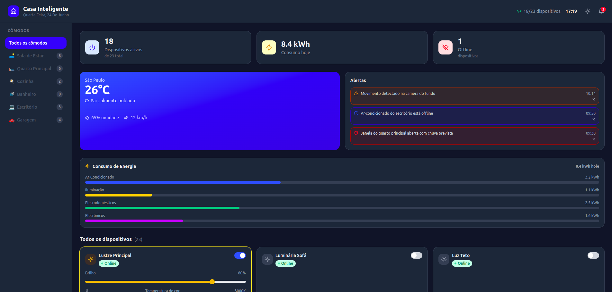
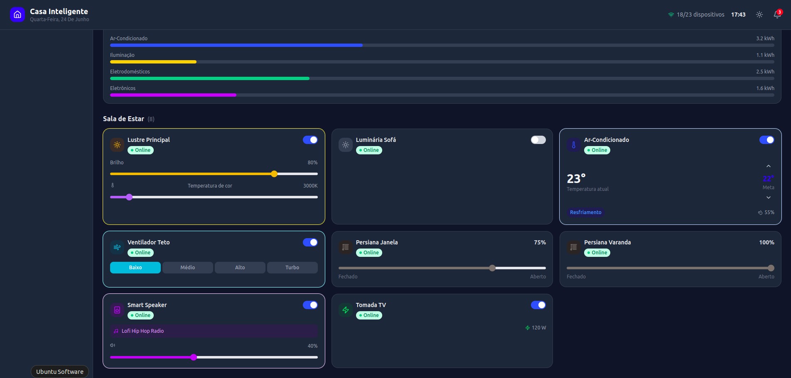

# 🏠 Home Assistant Dashboard

Painel de controle para uma casa inteligente desenvolvido com React, TypeScript e Vite.

O projeto simula um sistema centralizado de automação residencial, permitindo monitorar dispositivos conectados, acompanhar consumo de energia, visualizar alertas em tempo real e controlar diversos ambientes da residência.

---

## ✨ Funcionalidades

- 📊 Dashboard com visão geral dos dispositivos
- 🌡️ Monitoramento climático
- ⚡ Controle e acompanhamento do consumo de energia
- 💡 Controle de iluminação inteligente
- ❄️ Controle de ar-condicionado
- 🪟 Controle de persianas automatizadas
- 🔊 Gerenciamento de dispositivos multimídia
- 🚨 Sistema de alertas e notificações
- 📱 Interface responsiva e moderna
- 🏠 Organização por cômodos

---

## 📸 Demonstração

### Dashboard Principal



### Controle de Dispositivos



---

## 🛠️ Tecnologias Utilizadas

- React
- TypeScript
- Vite
- CSS3
- React Icons

---

## 🎨 Design

O projeto utiliza uma interface inspirada em painéis modernos de automação residencial, com:

- Tema Dark
- Cartões interativos
- Indicadores visuais de status
- Componentes reutilizáveis
- Layout responsivo
- Paleta de cores focada em usabilidade

---

## 🚀 Como Executar

### Clone o repositório

```bash
git clone https://github.com/seu-usuario/home-assistant.git
```

### Acesse a pasta

```bash
cd home-assistant
```

### Instale as dependências

```bash
npm install
```

### Execute o projeto

```bash
npm run dev
```

A aplicação estará disponível em:

```text
http://localhost:5173
```

---

## 📂 Estrutura do Projeto

```text
src/
├── assets/
├── components/
├── data/
├── hooks/
├── types/
├── App.tsx
└── main.tsx
```

---

## 📚 Objetivos do Projeto

Este projeto foi desenvolvido com foco em:

- Prática de React com TypeScript
- Componentização
- Gerenciamento de estados
- Organização de código
- Desenvolvimento de interfaces modernas
- Construção de projetos para portfólio

---

## 👩‍💻 Autora

Karen Felix

[](https://www.linkedin.com/in/karenfelixrocha/)

[](https://github.com/karenfrocha/karenfrocha)